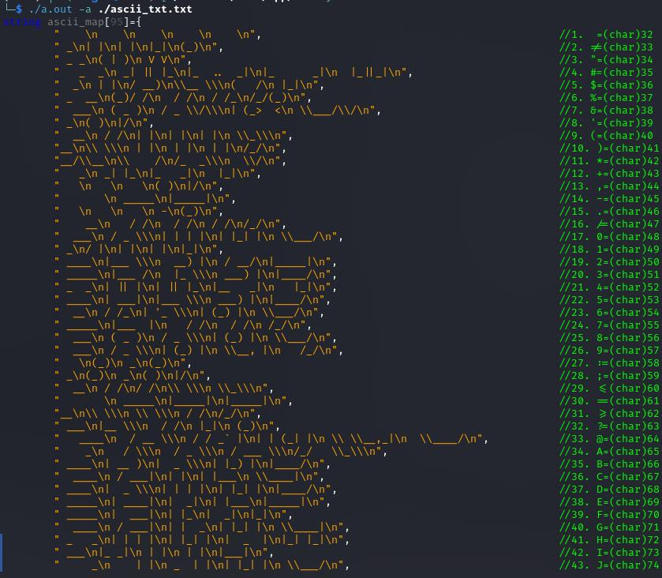
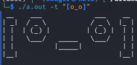
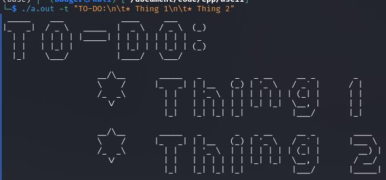

# Text to ASCII Converter

## Description

C++ program that converts text to ASCII art & displays within the terminal.

## TODO

* [ ] Get tabs to format with next line, etc.
* [ ] Add more **preprocessing** logic.
	1. [ ] Fix preprocessing lists (1. 1. 1. = 1. 2. 3.)
	1. [ ] Fix preprocessing roman numerals (regex error)
	1. [ ] Change storage sizes so `1000mb` will be `1gb`
* [ ] Add more **custom keywords**.
	1. [ ] \a{&lt;ascii art in txt fmt&gt;}
		* custom ascii art like `\a{    \n    \n    \n    \n    \n}` for example
	1. [ ] \c{&lt;custom ascii art&gt;}
		* animal ascii art, etc w/ `\c{rhino}` for example
	1. [ ] \f{&lt;filename&gt;}
		* read ascii art file w/ `\f{./panda.txt}` for example
* [ ] Add more **command line arguments**.
	1. [ ] `-s <size>` : change font size
	1. [ ] `-ct <color>` : change text color
	1. [ ] `-8 <filename>` : provides 8 byte char map for ascii art font file
* [ ] Load `ttf` files for ascii art fonts.
	1. Convert each character to bitmap.
	1. Resize bitmap to work for 8x8 characters.
	1. Convert bitmap to ascii art.
	1. Store each character in a text file.
* [ ] Automate differing shape of 8 byte char map.
```
    1    
  1 1    
 1  1    
    1    
11111111
```
=>
```
   /|    
  / |
    |
    |
____|___
```
* [ ] Allow unicode characters (don't limit to `<space>` - `~`).
	* Maybe load `ttf` files for ascii art fonts for unicode.

## Usage

```sh
./txt_2_ascii.out [options]
```

**Options**:
* -t <text> : text to convert to ascii art
* -w <filename> : filename to write ascii art to
* -i <filename> : filename to take as input text to be converted
* -c <filename> : filename to convert ascii art font file to code
* -r <reverse> : reverse the ascii art horizontally or vertically
	* h: horizontal
	* v: vertical
	* hv: horizontal & vertical
* -f <filename> : load font style from file
* -cf <filename="./std_font.txt",fill='#',blank=' '> : create font style file

<details>

<summary>Custom keywords</summary>

| Keyword | Description |
|---|---|
| `\n` | newline |
| `\t` | tab |
| `\d` | date |
| `\u` | username |
| `\h` | hostname |
| `\p` | current path/directory |
| `\0{<#>}` | formats number with commas |
| `\1{<#>}` | formats number to add `k`, `m`, `b`, etc. |
| `\l{<txt>}` | converts text to lowercase |
| `\u{<txt>}` | converts text to uppercase |
| `\ul{<txt>}` | converts text to title case (uppercase first letter of each word) |

**Example**: `./txt_2_ascii.out -t "Hello, \u\!"`
> NOTE: `\!` is not a custom keyword. It is just an exclamation point. You must include `\` before `!` since it is a special character in the terminal.

**Example**: `./txt_2_ascii.out -t "10^3\t=\0{1000}\n10^3=\1{1000}"`

</details>

<details>

<summary>Preprocessing</summary>

Repeated use of `1. ` will be replaced with `1.`, `2.`, `3.`, etc.
* **Example**: `1. Hello1. World` will be converted to `1. Hello2. World`

Roman numerals will be converted to arabic numerals.
* **Example**: `WW II` will be converted to `WW 2`

</details>

<details>

<summary>Generating Code</summary>

You can use your own ascii art fonts by creating a text file with the ascii art characters separated by newlines.
**Here's how**:
1. Create a text file with the ascii art characters separated by newlines.
	- The characters must be in order of the ASCII table, so the first character is ` ` and the last character is `~`.
	- `[\s]+$` is a regex that matches all whitespace at the end of a line in case the ascii art font has unnecessary whitespaces.
	- For periods, commas, etc., you can add newlines with spaces before the text so it will be display lower like this:
```
<3 spaces>
<3 spaces>
<3 spaces>
( )
|/
```
2. Type `./txt_2_ascii.out -c <your ascii art text file>` to generate the code for the ascii art.
	- The code will be outputted to the terminal.
	- The program will output a number, dot, space, and then the ascii art character, so you can see what it looks like if you want to find the number in the comment in the code and change it accordingly.
3. Copy the code and paste it into the  in place of the `ascii_map` map.

> This shows the program reading from the  of ascii art characters separated by newlines & then providing code for the ascii art.


The  looks like:

```
<4 spaces>
<4 spaces>
<4 spaces>
<4 spaces>
<4 spaces>

 _
| |
| |
|_|
(_)

 _ _
( | )
 V V

   _  _
 _| || |_
|_  ..  _|
|_      _|
  |_||_|
```

> The file is in order of the ASCII table, so the first character is ` ` and the last character is `~`.

</details>

## Compile

```sh
g++ ./txt_2_ascii.cpp -o ./txt_2_ascii.out
```

## Examples

> This image shows the alphabet in ascii art format.


> This image shows a face in ascii art format.


> This image shows a to-do list in ascii art. This also depicts how the program uses `\n` as newlines & `\t` as tabs (by default, tabs are 4 spaces).
